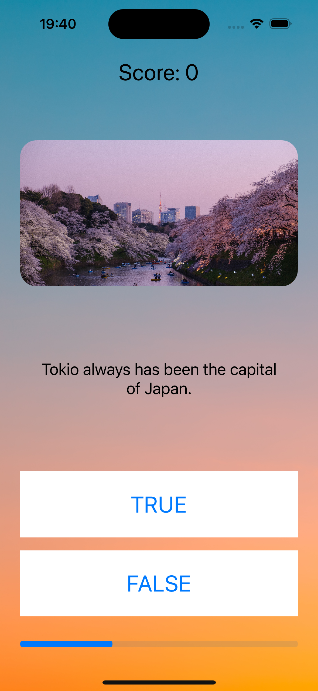
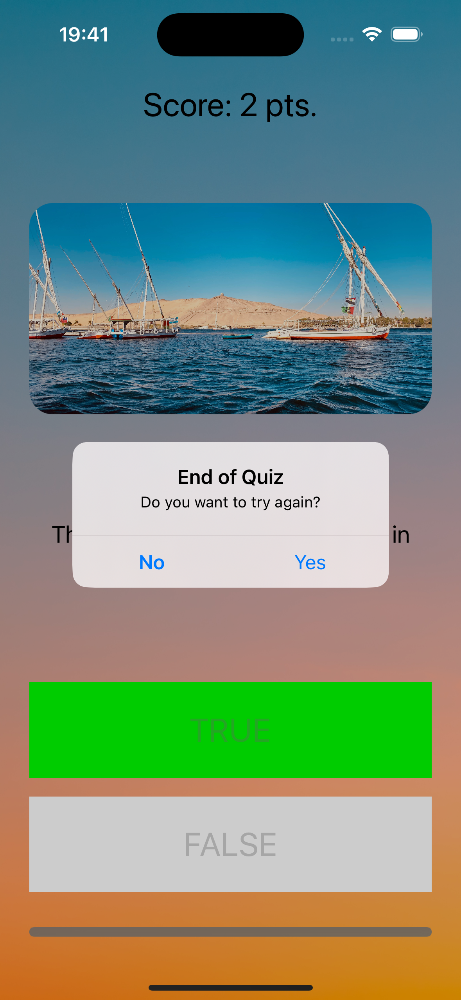

# Quiz App 📚📝

Quiz App is a simple question and answer application developed in Swift programming language. It follows the Model-View-Controller (MVC) architecture and allows users to participate in a quiz by answering true or false questions.

## Features ✨

- Interactive true/false questions: Users can answer a series of true/false questions presented in the app. ✅❌
- Scoring system: Each correct answer earns a score of 1, while incorrect answers do not affect the score. 🏆
- MVC architecture: The app is built using the Model-View-Controller architecture, ensuring a clear separation of concerns and maintainability. 🏢

## Prerequisites 📋

To run the Quiz App, make sure you have the following:

- Xcode 12.0 or higher ⚙️
- Swift 5.0 or higher 🔧

## Architecture 🏛️

The Quiz App follows the Model-View-Controller (MVC) architecture to ensure clarity and maintainability of the codebase. Here's a brief overview of each component:

- Model: The model represents the data and logic of the app. In this case, it manages the quiz questions, answers, and the user's score. 🗂️

- View: The view is responsible for presenting the user interface (UI) to the user. It displays the questions, answer buttons, and the score. 🖥️

- Controller: The controller acts as the intermediary between the model and view. It handles user interactions, updates the model with the user's answers, and updates the view accordingly. 🎮

## Screenshots 📸

Feel free to explore and enjoy the Quiz App! 🎉📚
